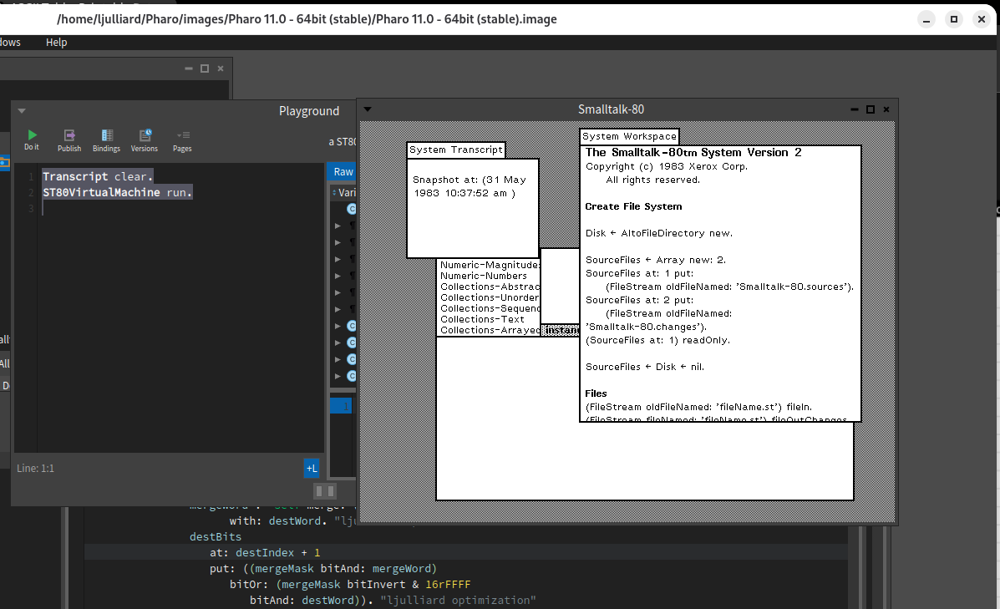

# Smalltalk-80 by the Book

This project is about delivering the promise of the book "Smalltalk-80 The Language and its Implementation" (aka the "Blue Book") as published by Xerox Parc in 1983. That is implementing and running the complete Smalltalk-80 VM environment using only the Smalltalk language itself. Want to know more about the background of this project? Read our [bits of history](doc/History.md).

Disclaimer: this project is still very much work in progress.  Do you feel like throwing some of your time at this project ? Feel free to pick any item in this [TODO](doc/TODO.md) list. All contributions be it bug reports, code fixes, missing features, improved documentation... are very welcome.

# Installation
* Install the Smalltalk [Pharo](https://www.pharo.org/) environment
* Run the Pharo launcher, install the Pharo 11 image and launch it.
* Click on the `Sources > Git repositories browser` menu and then the "+ Add" button
* Choose the "Clone remote repository" option
* In the Remote URL field  copy-paste this git repo URL  : `https://github.com/ljulliar/smalltalk-80-sources.git`and select the local directory of your choice where to clone the git repo (let's call it 'local_path' for future reference)
* Click on the ` Browse > Playground` menu
* In the Playground window type :
```
ST80VirtualMachine runWithImagePath: 'local_path/assets' keyboard: 'XX'.
```
where local_path is where you created your local git repo and XX is your host keyboard layout (for now only 'US' (US international) and 'FR' (French) keyboards are supported).  
* Right click in the Playground and Do It. Et voilà! 

# Smalltalk-80 at work
But does it actually work ? the answer is yes it does :-) As seeing is believing, here is a screenshot of the ST-80 VM running for real in my Smalltalk Pharo environment. 


The Smalltalk-80 startup screen that you see here is exactly as presented in the 1983 Blue Book. Notice the date of the VM image in the System Transcript window. Using your own machine keyboard and mouse you can interact with the environment: browse the class hierachy and its sources, execute some Smalltalk-80 code in a Workspace...

Paraphrasing a well known character of the French history: "With this screen, Developers, 40+ years of Computer Science history look down upon you.” :smile:

# Credits
I'd like to thank a number of people whose prior work made this project possible:
* The Blue Book by Adele Goldberg and Dave Robson (available [here](http://stephane.ducasse.free.fr/FreeBooks/BlueBook/Bluebook.pdf), courtesy Stéphane Ducasse)
* The [Pharo](https://www.pharo.org/) developers community for providing this remarkable Open Source Smalltalk environment
* [Dan Banay's Smalltalk-80 VM](https://github.com/dbanay/Smalltalk) project, a C++ implementation of the VM, that proved very helpful when I started debugging my Smalltalk implementation.
* Eliot Miranda for providing in plain text the [5 chapters of the Blue Book](http://www.mirandabanda.org/bluebook/bluebook_imp_toc.html) dedicated to the Smalltalk-80 specifications.
* And last but not the least, [Mario Wolczko ST-80 web page](http://www.wolczko.com/st80/) for putting together critical files that one absolutely needs to run the full Smalltalk environment, most notably the Virtual Machine image as published (on tapes!!) by Xerox Parc in 1983.
